其实感觉也没啥好写的，代码相关的基本都在注释里了。哦对了，把代码出处链接放一下，免得自己以后也忘了从哪抄的w

【真-极简爬坡式强化学习入门(代码现编，PyTorch版）】 https://www.bilibili.com/video/BV1Gq4y1v7Bs?share_source=copy_web&vd_source=a75ddd5333dd0777c23d1abe1cbb546f

视频底下还有视频参考的教材和源代码，我就懒得贴那么多了。

2022/08/22

现在的情况是要实现PER，但我发现样本采集出来之后它们的优先级不好更新，然后看别人实现是用的SumTree，所以打算试试

PER写是写出来了，但是跑的巨慢，而且性能并不太理想，可能是因为没有按照优先级顺序去删回放缓存里的内容。

几张结果图

doubleQ，episode 2000（buffer size 5000）

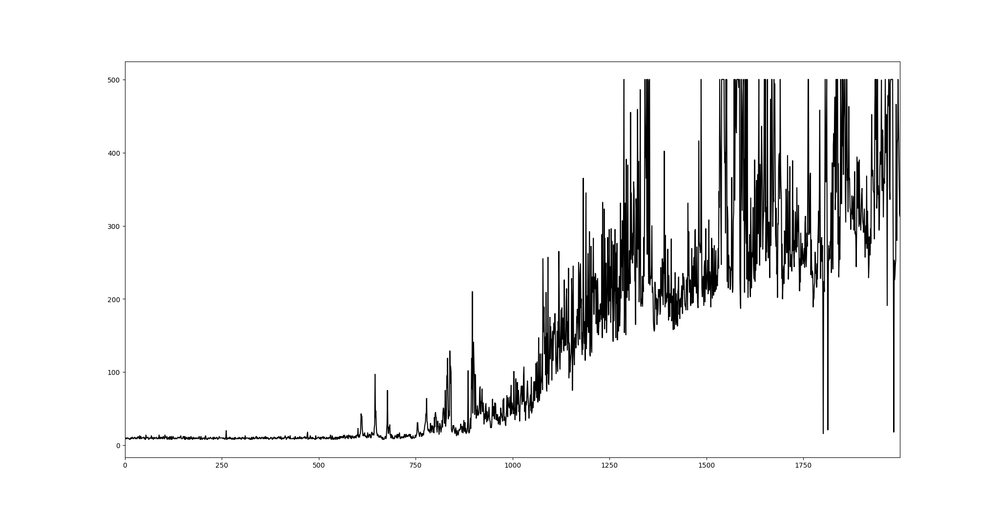

doubleQ，episode 3000（buffer size 5000）

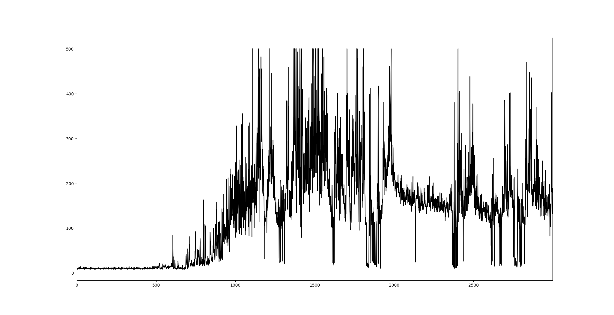

PER，buffer size 5000（删除最老的）

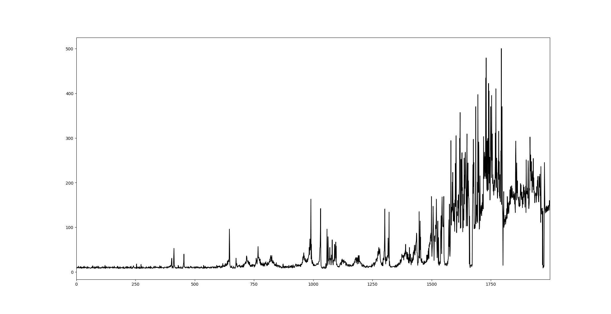

这个效果不怎么好而且巨慢

PER，buffer size 1000（删除最不优先的）

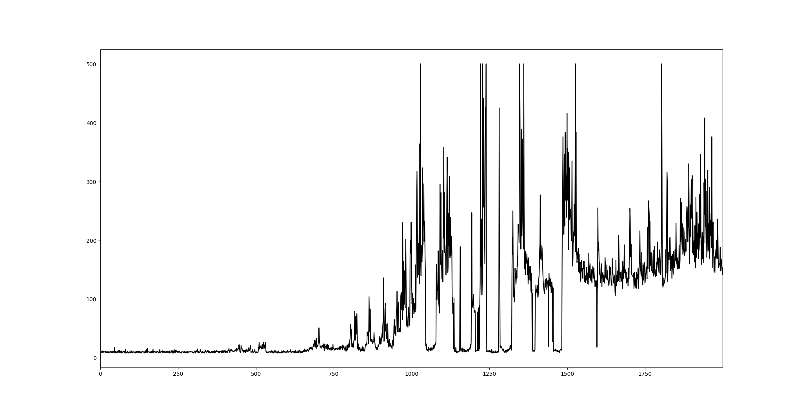

这个也很慢，比5000的好不到哪去

PER效果差的原因可能是因为没加权重

然而加了权重之后仍然巨慢，效果还没出，但看起来也是在700多的时候开始升

PER加了权重，buffer size 1000

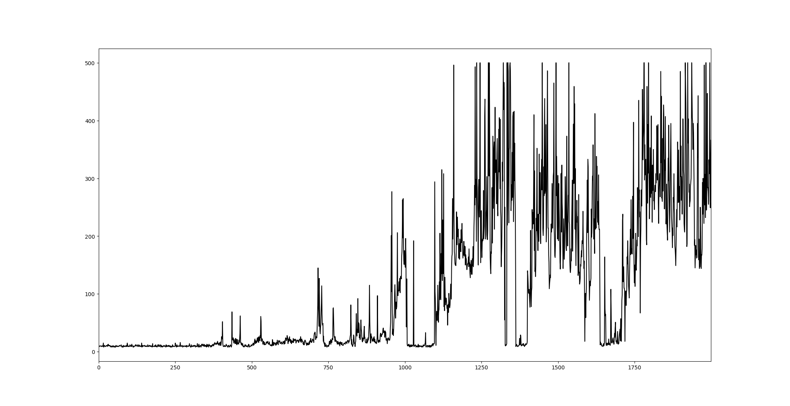

还是不明白为什么会有几个跌回0的区间

PER加权重，buffer size 1000，start size 100，这次测试结果有500满奖励

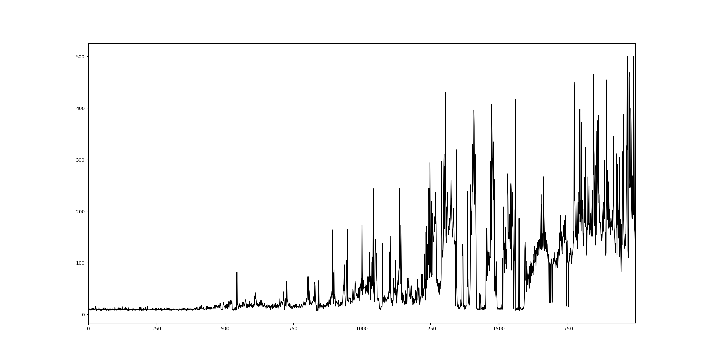

同上，加了探索概率衰减，从1.0开始，每1步衰减一次，衰减值为0.001

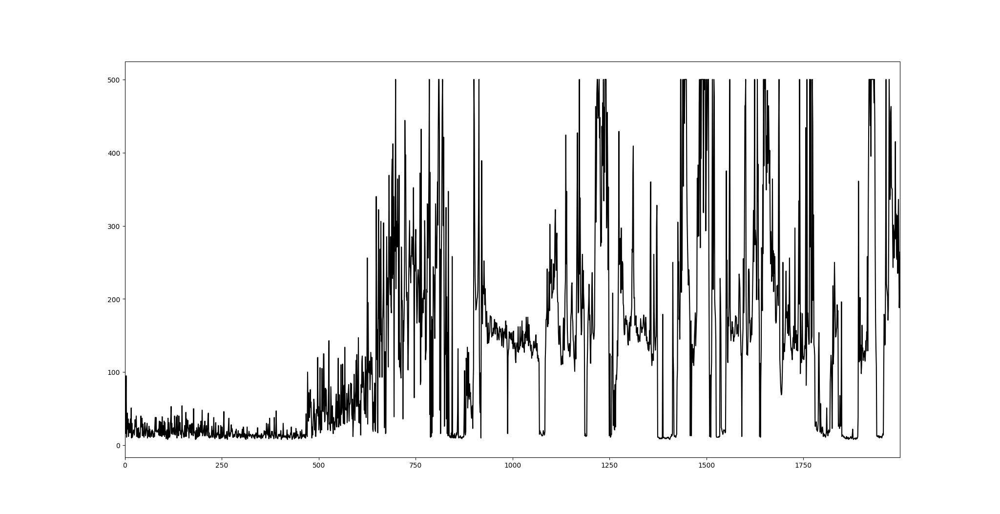

寄了

同上，gamma改成了0.95

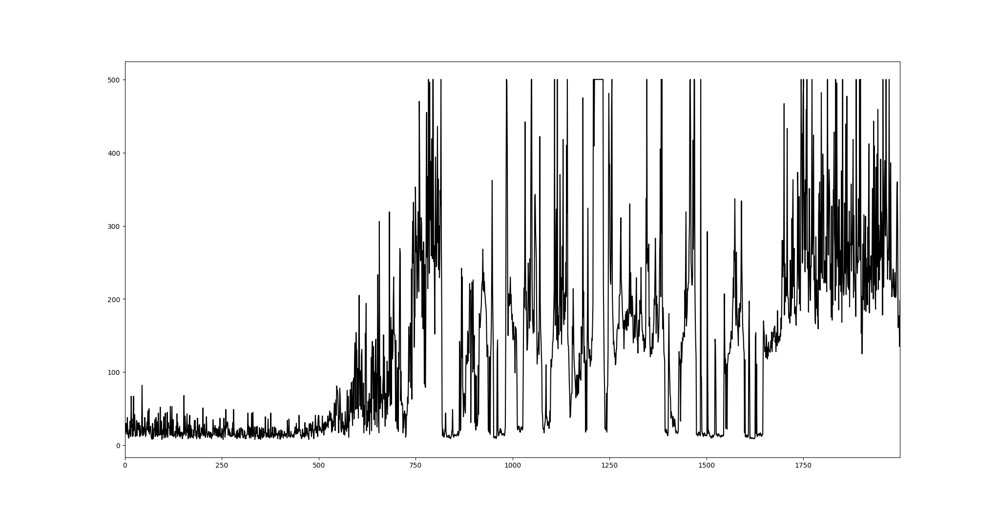

同上，gamma改成0.85

同上，gamma改成0.95

上面的结果都不具有可重复行，效果可能时好时坏，并不是因为随机数什么的原因，是因为探索过程原则上就是需要随机的，但可能是因为训练集数太少，没有收敛到统一的值

终于有组参数收敛了！！！而且最后的测试结果表现出来的策略是从头开始就是好的

doubleQ，参数如下图：

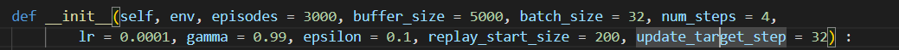

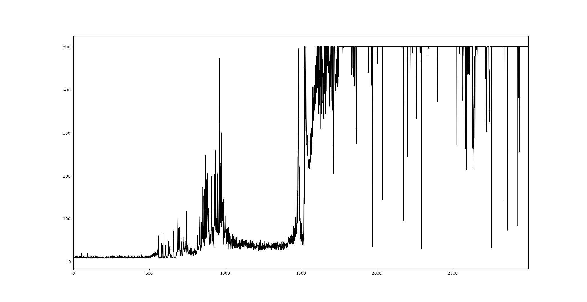

尖刺是e贪心的探索导致的，是正常现象。接下来就是反复实验看是不是都能够收敛了

相同参数第二组结果：

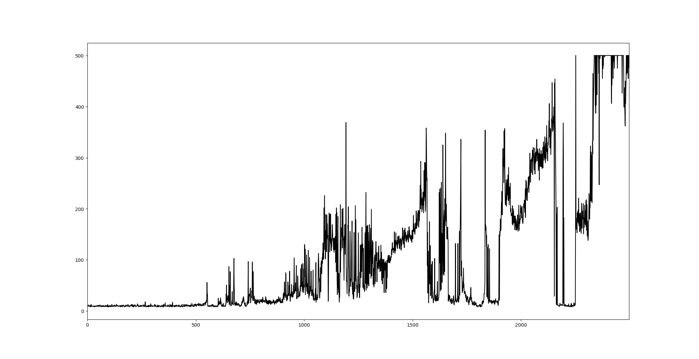

但这组总感觉学习的过程很怪，好几次掉到最底下

相同参数第三组结果：

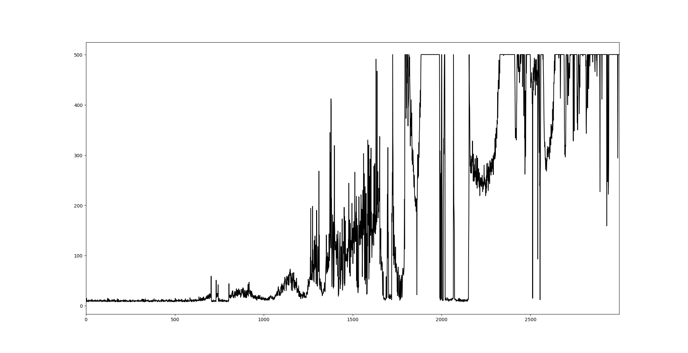

这组的收敛情况更不乐观，甚至感觉像没收敛，最后的结果演示在前期没有进行很好的策略，到后期才稳住的

gamma改成1.0，也能收敛，晚了一点才收敛，但学到的策略是从最开始就好的

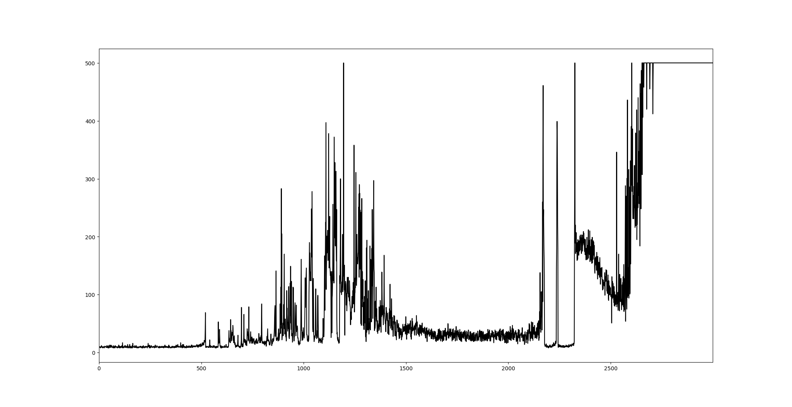

gamma1.0第二次，感觉没有收敛，但测试的策略也很好

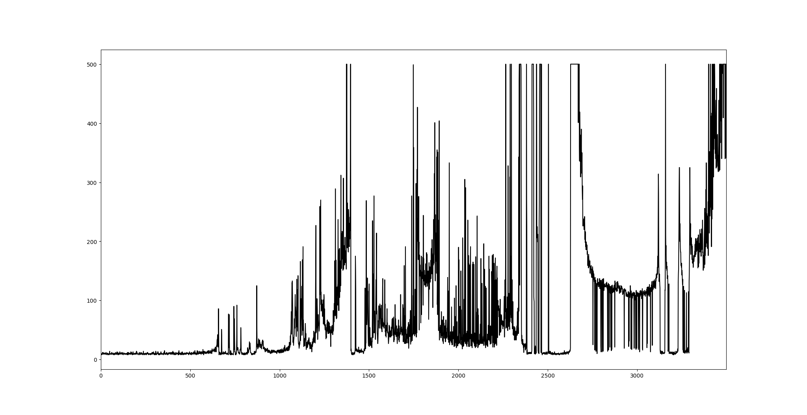

gamma0.99，这次收敛情况不好感觉真的有可能是因为replay buffer满了

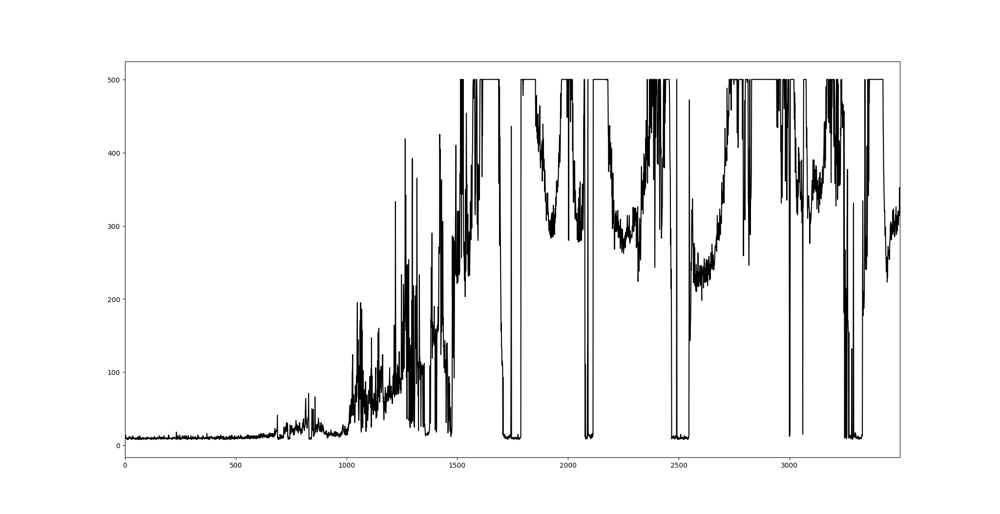

目标网络更新步数改为50步，感觉不太行了

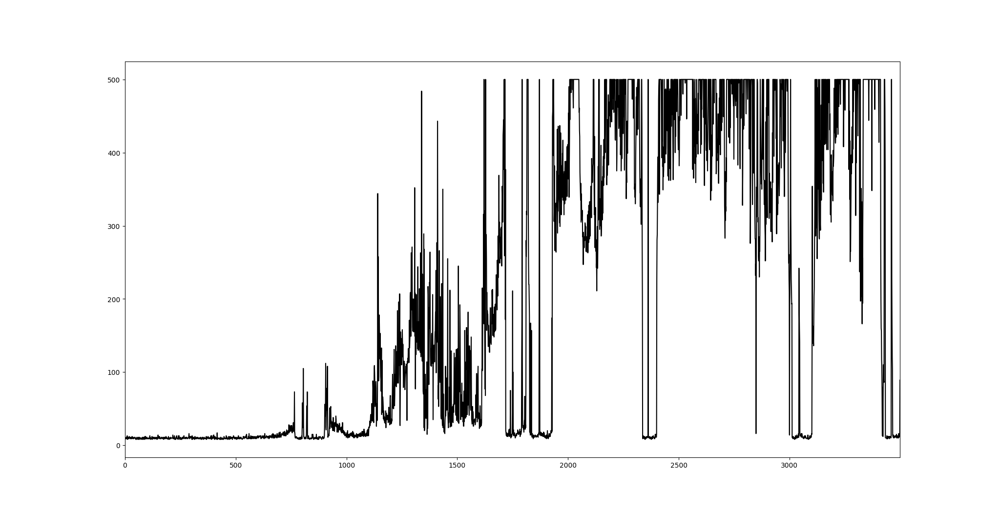

改为100步，训练到后面反而不行了

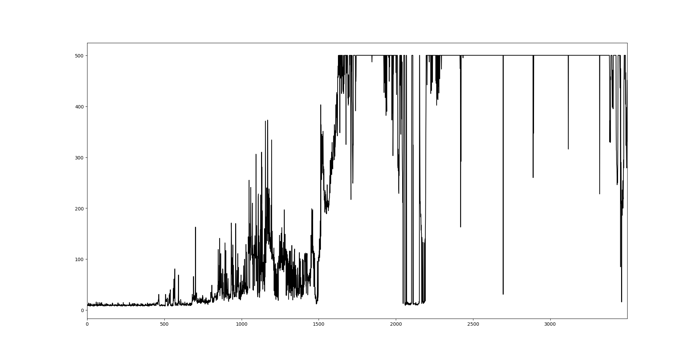

改为10步，训练效果还可以

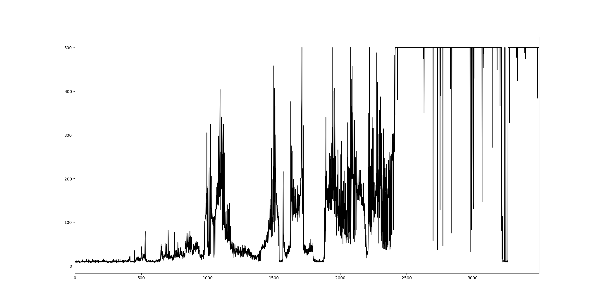